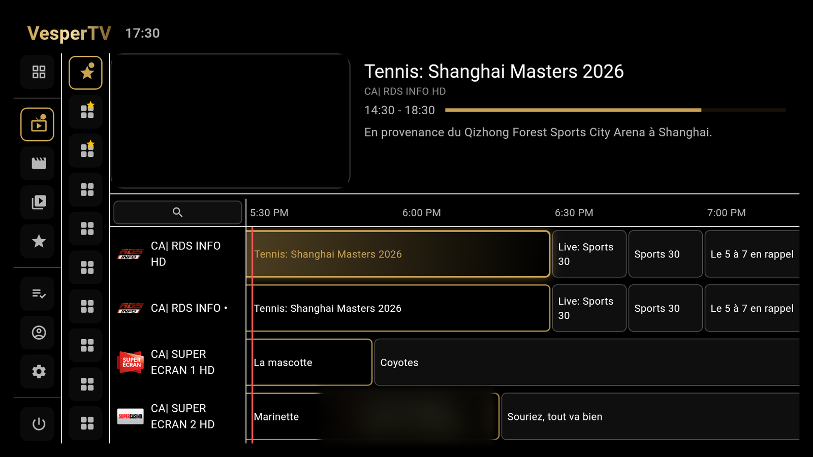
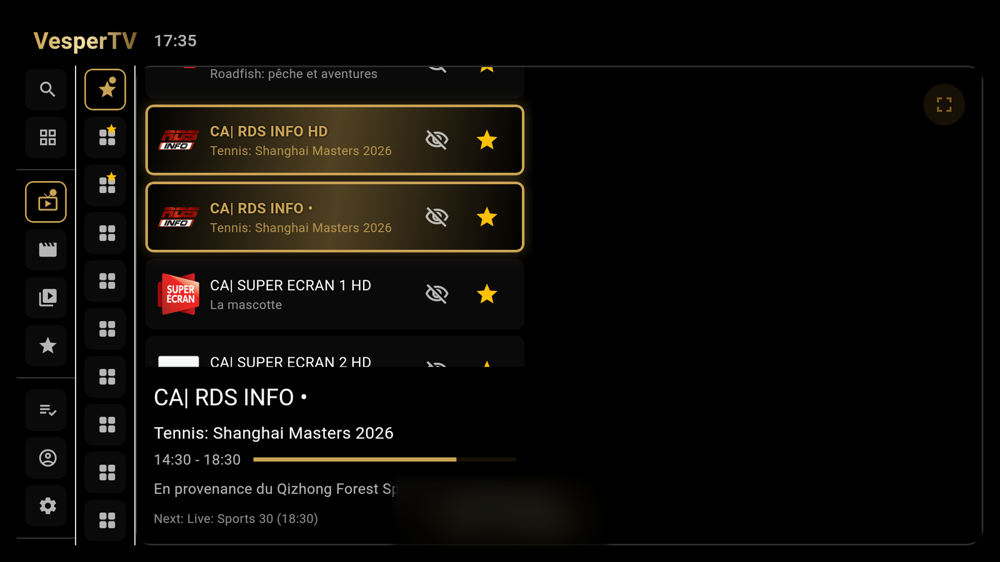
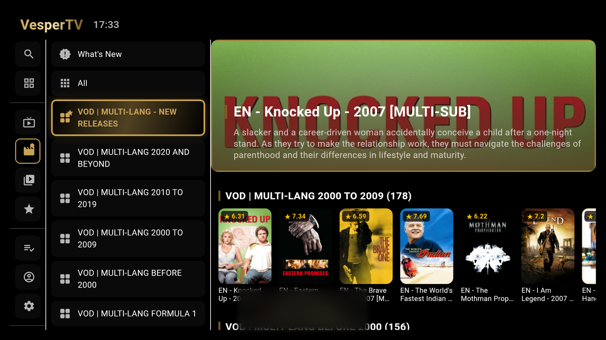
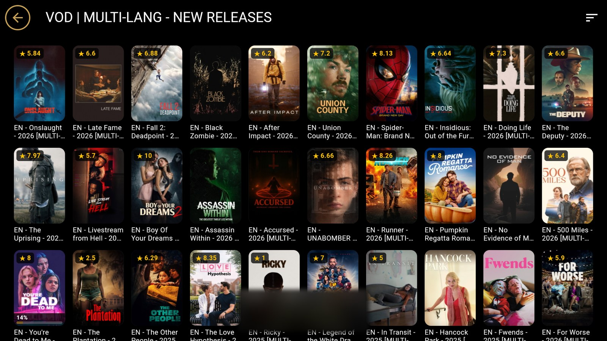
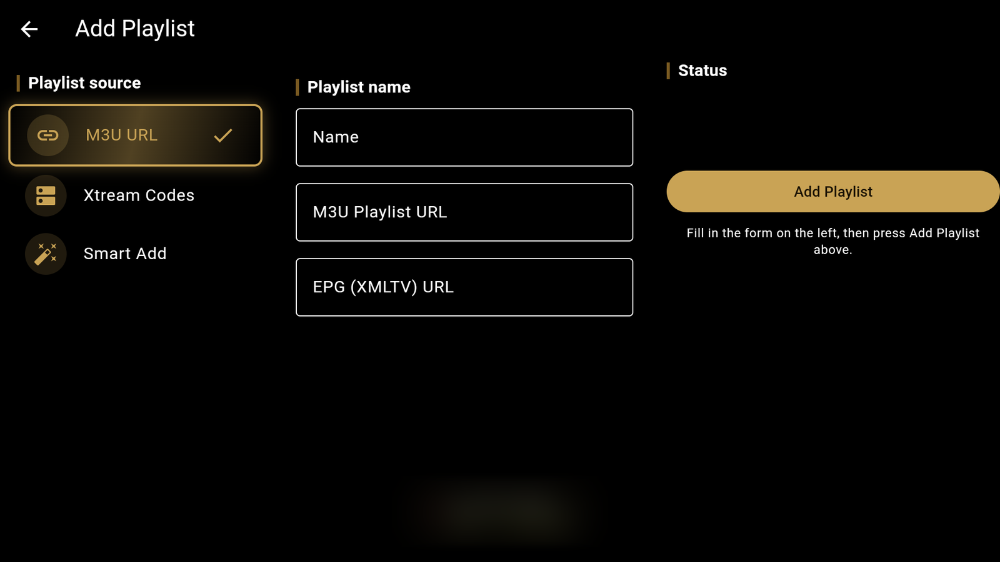
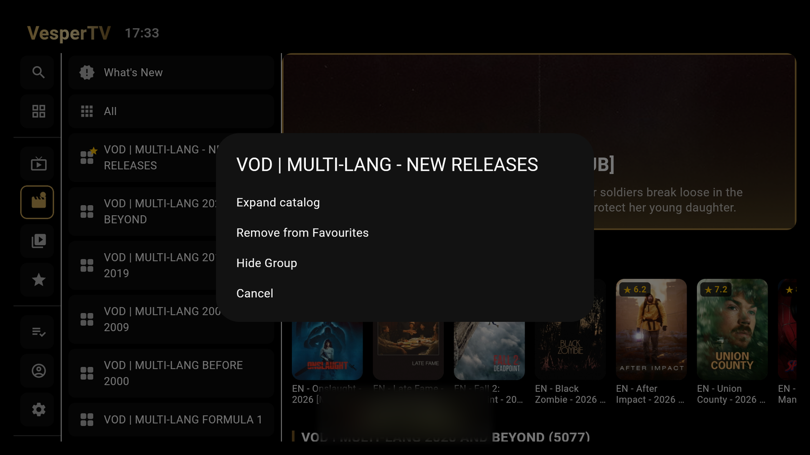

# VesperTV

An M3U / Xtream Codes (XC API) IPTV player for Android, with XMLTV EPG
support. Built and tested on Android TV boxes (Formuler), Firesticks, and
phones.

## Download

Grab the latest APK from the [Releases](../../releases) page —
`app-release.apk` works across phones, Android TV boxes, and
Firesticks. Install it directly, or side-load it via
[Downloader](https://amzn.to/2GYuEz9) on Fire TV / Android TV.

## Screenshots

  
  
  
  
  
  

## Features

- M3U and Xtream Codes playlist support, with an XMLTV EPG guide
- Live TV, Movies, and TV Shows (series/episodes) catalogs
- Resume playback position, subtitles, skip/seek controls
- Auto-advance to the next episode with an "Up Next" prompt
- Favorites (channels and groups) and group management (hide/show categories)
- Full remote/D-pad navigation on TV boxes and Firesticks, touch-first layout
  on phones
- Theming with selectable palettes, including a black-and-gold "Dark / Gold" look

## Setup

On first launch, add your playlist under Settings — either a direct M3U URL
(with an optional separate EPG URL), or Xtream Codes credentials (server,
username, password).

## Community

Bug reports, suggestions/improvements, or general discussion — join the
[Discord server](https://discord.gg/DDeGDHvFY), or open an issue here on
GitHub.
